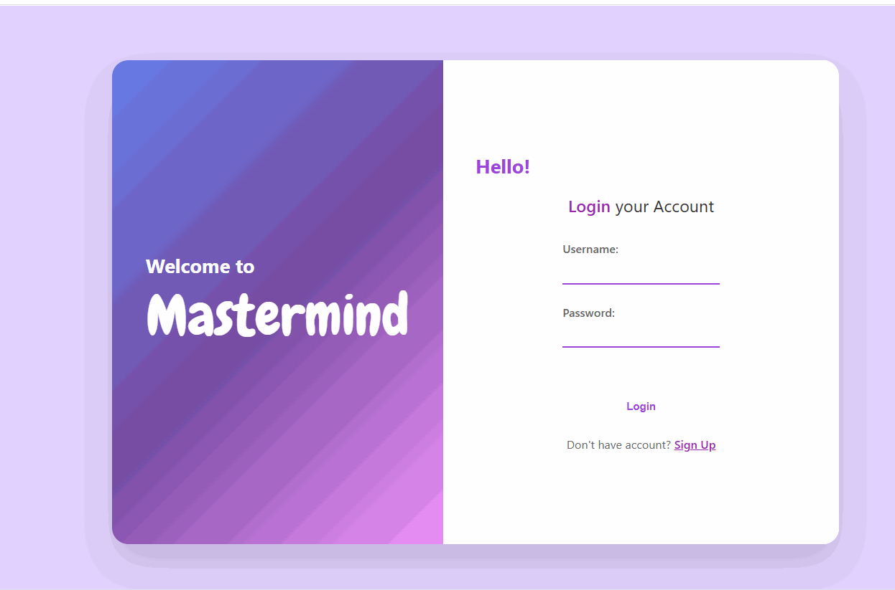

# Mastermind Game

Welcome to Mastermind, a modern full-stack implementation of the classic code-breaking game where players use logic and deduction to crack a secret number sequence!

## About

Mastermind challenges players to uncover a hidden numerical code by making strategic guesses and analyzing feedback. This implementation features a sleek React frontend built with Vite, robust FastAPI backend with JWT authentication, and comprehensive player statistics tracking with SQLite database.

Players receive hints about their guesses indicating how many numbers are correct and how many are in the correct position, helping them deduce the secret code within the allowed attempts. The game features an advanced scoring system with penalties and AI-powered hints using Google's Gemini API.

## Features

### Core Game Features

- **Multiple Difficulty Levels**: Three challenging levels with different complexity
  - **Easy**: 4 digits (0-5), 12 attempts
  - **Medium**: 4 digits (0-7), 10 attempts
  - **Hard**: 4 digits (0-9), 8 attempts
- **Scoring System**: Dynamic scoring with rewards and penalties
- **AI-Powered Hints**: Intelligent strategic guidance using Google Gemini AI
- **Real-time Feedback**: Instant game state updates and hint generation

### Player Features

- **JWT Authentication**: Secure token-based authentication system
- **Player Profiles**: Persistent player data
- **Score Tracking**: Detailed scoring with historical data
- **Game Session Management**: Track current game session state and individual attempts
- **Strategic Penalty System**: Score penalties when current attempt performs worse than previous attempt

## Technologies with Documentation

Mastermind is built using modern technologies with comprehensive documentation and community support.

### Backend Technologies

- **[FastAPI](https://fastapi.tiangolo.com/)** - Modern, fast (high-performance) web framework for building APIs with Python 3.12+
- **[SQLModel](https://sqlmodel.tiangolo.com/)** - SQL databases in Python, designed to simplify working with SQL databases with SQLAlchemy and Pydantic
- **[SQLite](https://www.sqlite.org/docs.html)** - Lightweight, serverless, self-contained SQL database engine
- **[Pydantic](https://docs.pydantic.dev/)** - Data validation using Python type hints with email validation support
- **[Python-JOSE](https://python-jose.readthedocs.io/)** - JavaScript Object Signing and Encryption library for JWT token handling
- **[Passlib](https://passlib.readthedocs.io/)** - Password hashing library with bcrypt support
- **[Google Gemini API](https://ai.google.dev/docs)** - Google's advanced AI model for intelligent hint generation
- **[Python 3.12+](https://docs.python.org/3.12/)** - Latest Python with enhanced performance and new features
- **[Uvicorn](https://www.uvicorn.org/)** - Lightning-fast ASGI server implementation
- **[Python-dotenv](https://github.com/theskumar/python-dotenv)** - Environment variable management
- **[Requests](https://requests.readthedocs.io/)** - HTTP library for external API integration

### Frontend Technologies

- **[React 19](https://react.dev/)** - Modern JavaScript library for building user interfaces
- **[Vite](https://vite.dev/)** - Next-generation frontend build tool with lightning-fast HMR
- **[TypeScript](https://www.typescriptlang.org/)** - Typed superset of JavaScript for better development experience
- **[ESLint](https://eslint.org/)** - Pluggable and configurable linter tool for identifying patterns in JavaScript/TypeScript
- **[Node.js](https://nodejs.org/)** - JavaScript runtime built on Chrome's V8 JavaScript engine

### Development Tools

- **[Vite Plugin React](https://github.com/vitejs/vite-plugin-react)** - Official Vite plugin for React support
- **[React Hooks ESLint Plugin](https://github.com/facebook/react/tree/main/packages/eslint-plugin-react-hooks)** - ESLint rules for React Hooks
- **[Python Type Hints](https://docs.python.org/3/library/typing.html)** - Static type checking support
- **[Pytest](https://docs.pytest.org/)** - Simple yet powerful testing framework for Python
- **[HTTPX](https://www.python-httpx.org/)** - Async HTTP client for testing FastAPI endpoints

## Technology Stack

### Backend

- **FastAPI**: Modern, fast web framework for building APIs
- **SQLModel**: SQL databases with Python type hints
- **Python 3.12+**: Latest Python features and performance improvements
- **SQLite**: Lightweight, serverless database
- **JWT Authentication**: Secure token-based authentication
- **Google Gemini API**: AI-powered hint generation

### Frontend

- **React 19**: Modern JavaScript library for building user interfaces
- **Vite**: Next-generation frontend build tool with fast HMR
- **Node.js**: JavaScript runtime environment
- **CSS3**: Modern styling and responsive design

## Getting Started

### Prerequisites

- **Node.js** (v18 or higher)
- **Python 3.12+**
- **Git**

### Installation

1. **Clone the repository**

   ```bash
   git clone https://github.com/Gabyara237/mastermind-game
   cd mastermind-game
   ```

2. **Backend Setup**

   ```bash
   cd mastermind-api
   python -m pip install -r requirements.txt
   ```

3. **Frontend Setup**
   ```bash
   cd ../mastermind-frontend
   npm install
   ```

### Running the Application

1. **Start the Backend Server**

   ```bash
   cd mastermind-api
   python -m uvicorn main:app --reload --port 8000
   ```

   The API will be available at `http://localhost:8000`
   API documentation: `http://localhost:8000/docs`

2. **Start the Frontend Development Server**
   ```bash
   cd mastermind-frontend
   npm run dev
   ```
   The application will be available at `http://localhost:5173`

## Game Mechanics

### Difficulty Levels

- **Easy**: 4 digits (0-5), 12 attempts
- **Medium**: 4 digits (0-7), 10 attempts
- **Hard**: 4 digits (0-9), 8 attempts

### Scoring System

The game features a sophisticated scoring system that rewards accuracy and strategic thinking:

#### Points per Correct Number

- **Easy**: 600 points
- **Medium**: 800 points
- **Hard**: 1,200 points

#### Points per Correct Position

- **Easy**: 1,200 points
- **Medium**: 1,600 points
- **Hard**: 2,400 points

#### Penalty System

Strategic depth is added through a penalty system. If your current attempt scores lower than your previous attempt:

- **Easy**: -50 points
- **Medium**: -100 points
- **Hard**: -150 points

### AI-Powered Hints

Get intelligent hints to help you crack the code! Our AI, powered by Google's Gemini API, analyzes your previous attempts and provides strategic guidance to improve your next guess. Use hints wisely to avoid costly penalties and maximize your score.

## How to Play

1. **Create Account or Login**

   - New players: Register with username and email
   - Returning players: Login with credentials

2. **Select Difficulty Level**

   - Choose your preferred challenge level
   - Each level has different code lengths and complexity

3. **Make Strategic Guesses**

   - Enter your guess for the secret 4-digit code
   - Receive feedback on correct numbers and positions
   - Use logic and AI hints to deduce the secret code
   - Watch your score accumulate with each correct element

4. **Use AI Hints Strategically**

   - Request AI-powered hints when needed
   - Analyze the strategic guidance provided
   - Balance hint usage with penalty considerations

5. **Track Your Progress**
   - View your game statistics (Coming soon)
   - Monitor your score improvements
   - Challenge yourself with harder difficulties

## API Endpoints

### Authentication

- `POST /api/v1/auth/register` - Register new user
- `POST /api/v1/auth/login` - User login
- `GET /api/v1/auth/me` - Get current user info

### Game Management

- `POST /api/v1/game/start_game/` - Start new game session
- `POST /api/v1/game/guess/` - Submit a guess
- `POST /api/v1/game/get_ai_hint/` - Get AI-powered hint
- `GET /api/v1/game/top_players/` - Get leaderboard

## Database Schema

The application uses SQLite with SQLModel for the following relational structure:

- **User**: Authentication and user management (JWT token-based)
- **Player**: Game profiles linked to users with scoring data
- **GameSession**: Individual game instances with difficulty settings
- **GameAttempt**: Player guesses, results, and score calculations

### Database ERD


PNG created with **[dbdiagram.io](https://dbdiagram.io/)**

## Project Structure

```
mastermind-game/
├── mastermind-api/           # Backend API
│   ├── app/                  # Main application package
│   │   ├── auth/            # Authentication logic
│   │   ├── client/          # External API clients
│   │   ├── database/        # Database configuration
│   │   ├── routes/          # API route definitions
│   │   └── services/        # Business logic services
│   ├── models.py            # Database models
│   ├── schemas.py           # Pydantic schemas
│   ├── main.py              # Application entry point
│   ├── tests                # Tests
└── mastermind-frontend/      # React frontend
    ├── src/
    │   ├── components/      # React components
    │   ├── pages/           # Page components
    │   └── services/        # API service calls
    └── public/              # Static assets
```

## Video Walkthrough

Here's a walkthrough of implemented features:



GIF created with **[ScreenToGif](https://www.screentogif.com/)**

## Development

### Running Tests

```bash
cd mastermind-api
python -m pytest
```

### Code Style

The project follows Python PEP 8 standards and uses modern React patterns.

## Future Enhancements

- [ ] **Game Timer System**: Add chronometer for individual attempts or complete game sessions
- [ ] **Detailed User Profile Statistics**: Win rate by difficulty, average attempts, best times
- [ ] **Individual Game Scoring**: Track score for each game session (currently uses global player score)
- [ ] **Responsive Design**: Mobile-first CSS styling for all screen sizes

## Contributing

Contributions are welcome! Please feel free to submit a Pull Request.

---

Happy Code Breaking! 🧩
